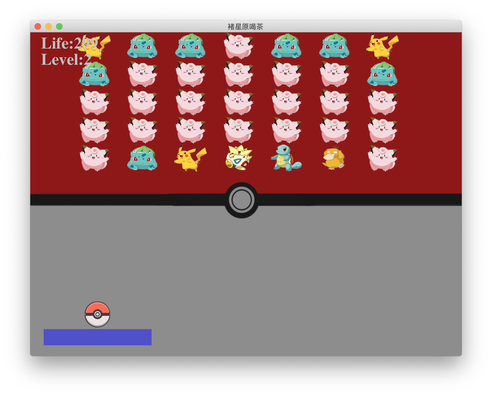

# 褚星原喝茶 cxy-drinking-tea

Java课程小组作业，一个以褚星原喝茶为主题的弹球小游戏。

## 效果图！

## 1. 构思

在老师给的简陋例程的基础上，完善游戏规则，增加一系列关卡，丰富游戏画面。

### 基本功能的完善

基本游戏规则上，要完善功能包括：

1. 杆的初始化：游戏开始时，由玩家自定义杆的位置，单击左键，小球以一个随机的角度出射。
2. 砖块的生成：写一个砖块类，包括不同的形状和碰撞次数等属性，实现在界面上方随机生成的方法。
3. 碰撞检测：当小球与杆碰撞时，根据碰撞位置，以一个恰当的函数，确定小球的出射角度和速度；当小球与砖块碰撞时，使小球反弹，并减少砖块寿命。
4. 总生命值：玩家在每个关卡拥有3条生命。
5. 界面按钮：完善「开始游戏」「再来一局」「退出」等按钮
6. 图片替换：把小球、砖块等图形替换成图片（图片先随便找，之后再自己画之类的就行）
7. 代码重构：将原本的单文件、面向过程的代码重构为多层次、面向对象的代码

### 游戏性的丰富

1. 关卡设计：总共设计6个难度递增的关卡，每关设计不同的砖块地图。
2. 美工设计：不同关卡拥有各自的主题，配以丰富的小球图片、砖块图片、背景图片、配音。小球在碰撞、消除砖块、失败时有丰富的效果。
3. 暂停、继续按钮：方便游戏的暂停与继续

## 2. 任务步骤

### step 1: 准备

1. 读懂PinBall.java源码
2. 注册GitHub账号，跟随新手帮助学会使用之

### step 2: 大框架

* [x] 砖块类： 朱珈印
* [x] 地图生成类：褚星原
* [x] 砖块消除检测：朱珈印
* [x] 杆的初始化：朱珈印
* [x] 碰撞检测：吴奕萱
* [x] 生命值：朱珈印
* [x] 界面按钮模块：朱睿琦

### step 3：完善🆙

#### 设计方面

**截止时间：周四之内**

* [x] 砖块地图设计：李佳弥
* [x] 关卡图片设计：熊德惠、朱睿琦
  （皮卡丘 星空火箭 银河行星）（背景图+配套的砖块图片）

#### 技术方面

**截止时间：周六之内**

* [x] 代码重构：朱珈印
* [x] 图片替换：李佳弥
* [ ] 暂停、继续按钮：褚星原、熊德惠
* [ ] 初始界面：吴奕萱、朱睿琦
  （融合朱睿琦写的界面按钮模块，使其真正可以使用）
* [x] 实现关卡功能：朱珈印

#### 统筹方面

**截止时间：周六之内**

* [ ] 撰写实验文档：朱珈印

## 3. 任务要求

希望不论是谁负责写的代码部分，大家都要阅读，全面掌握整个项目的代码，这样才能学有所成~
